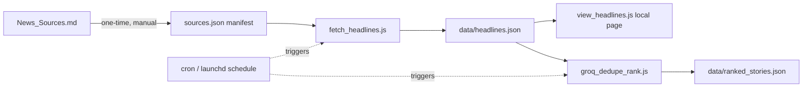

# Instructions

Requirements: Node.js (no npm packages needed — everything uses built-ins).

## 1. CNN news viewer (`server.js`)

Fetches CNN's Google News sitemap and serves the headlines as a barebones web page.

```
node server.js
```

Then open `http://localhost:3000` in a browser.

## 2. Batch sitemap checker (`check_sitemaps.js`)

Checks ~67 publishers for a working, scrapable Google News sitemap (via
`robots.txt` first, then common guessed paths) and writes the results to
[News_Sources.md](News_Sources.md).

```
node check_sitemaps.js
```

Takes about 1–2 minutes. Re-running regenerates `News_Sources.md` from
scratch — any manual edits to that file will be overwritten.

To add or remove a publisher, edit the `SITES` array near the top of
`check_sitemaps.js` (format: `[category, name, host]`).

## 3. PLANNED: Headline aggregator + Groq dedupe/ranking pipeline

> **Status: plan only — nothing below has been built yet.** This section is the
> agreed design for the next phase. Do not build or run any of it until told
> to proceed. When approved, this section should be updated to describe what
> was actually built (and this status note removed/updated).

### Goal

Pull today's headlines from every "Successful" source in
[News_Sources.md](News_Sources.md), tag each headline with a region (**U.S.**
or **World**) and a topic category, show them on a simple local web page for
visual spot-checking, and then hand the same data to Groq (a free, hosted AI
API) to (a) merge duplicate coverage of the same story across sources, and
(b) rank the resulting stories by newsworthiness. The whole thing must be
free, dependency-light, and safe to re-run on a schedule.

### Data flow (high level)



Two on-disk JSON files are the entire "database": `data/headlines.json`
(raw, tagged headlines from the latest fetch) and
`data/ranked_stories.json` (Groq's deduped + ranked output). No database
server, no paid hosting — plain files, same philosophy as the rest of this
project.

### Step 1 — Build `sources.json` (one-time manifest)

Parse the "Successful" sources currently listed in `News_Sources.md` into a
small config file, `sources.json`, with one entry per source:

```json
{ "name": "BBC News", "url": "https://www.bbc.com/sitemaps/https-sitemap-com-news-1.xml", "region": "World" }
```

**Why a separate manifest instead of reading `News_Sources.md` at runtime:**
`News_Sources.md`'s section headings (Global Wire Services, U.S.,
Financial & Business, etc.) don't line up 1:1 with "U.S. vs. World," so the
region tag needs to be a deliberate per-source decision, not derived
automatically. A manifest also insulates the fetch script from future
reshuffling of `News_Sources.md`'s formatting.

**Region-tagging rule:**
- Everything under "U.S." → `U.S.`
- Everything under "Global Wire Services" and "International" → `World`
- Sports / Science / Health / Tech / Financial & Business sources default to
  `U.S.` *except* explicit foreign outlets — e.g. **Nikkei Asia → `World`**.
  Apply the same judgment call to any other clearly non-U.S. outlet in those
  sections (there may be more over time).

This is a manual, one-time classification (fast, since it's ~54 rows), not
something worth writing detection logic for.

### Step 2 — `fetch_headlines.js` (data collection)

For each source in `sources.json`:
1. Fetch the sitemap XML and extract `(headline, link)` pairs — reuse the
   existing `evaluate()` / `fetchText()` sitemap-parsing logic already
   written in `check_sitemaps.js` (gzip detection, `news:title` extraction,
   etc.) rather than re-inventing it.
2. Assign a **topic category** to each headline (see Step 3).
3. Attach the source's `region` tag straight from `sources.json`.
4. Wrap everything into one JSON array and overwrite `data/headlines.json`
   completely on every run (no appending, no history) — keeps storage tiny
   and avoids duplicate buildup between runs.

Each stored record: `{ headline, link, source, region, category, fetchedAt }`.

Wrap each source's fetch in try/catch so one broken/blocked source (this will
happen — some publishers rate-limit or go down) never aborts the whole run.

### Step 3 — Topic categorization (headline-level, lightweight)

The 7 target buckets: **Politics, Business, Technology, Arts & Entertainment,
Sports, Science, Health**.

A single wire source (BBC, Reuters, NYT, etc.) publishes headlines across
*all* of these topics, so the category can't be assigned per-source the way
region is — it has to be judged per-headline. Since perfect accuracy isn't
required (Groq cleans this up later), use a cheap two-part heuristic instead
of calling any AI model for this step:

1. **Section prior:** if the source came from `News_Sources.md`'s Tech,
   Science, Health, or Sports sections, default that headline to
   Technology / Science / Health / Sports respectively.
2. **Keyword override:** for general-news sources (Global Wire Services,
   International, U.S., Financial & Business) — and to override the prior
   above when it's clearly wrong — scan the headline text for topic keywords,
   e.g.:
   - Politics: election, president, senate, congress, minister, parliament, war, policy
   - Business: market, stock, earnings, inflation, tariff, merger, IPO, bank, economy
   - Technology: app, AI, chip, software, iPhone, startup, cybersecurity
   - Arts & Entertainment: movie, film, album, actor, box office, celebrity, TV series
   - Sports: match, championship, coach, tournament, league, score, team
   - Science: study, research, NASA, climate, space, discovery
   - Health: vaccine, hospital, FDA, outbreak, disease, mental health
   - No match → fall back to **Politics** (the general "hard news" catch-all).

This runs in plain JavaScript with no external calls — fast, free, and good
enough for a first pass. Note in the UI (or just accept) that this
categorization is approximate; Groq is not being used here to keep this step
instant and free of rate limits.

### Step 4 — `view_headlines.js` (the spot-check page)

A tiny local HTTP server (same pattern as `server.js`) that reads
`data/headlines.json` fresh on every page load — no separate "build the
HTML" step needed, so the page always reflects the latest fetch without
extra plumbing.

Layout, grouped under the 7 category headings, one row per headline:

```
[World] BBC News blocks new tariff proposal from EU  — BBC News
[U.S.]  Senate advances spending bill after late-night vote — NPR
```

- `[World]` / `[U.S.]` tag first, plain bracket text, no color needed.
- Headline text is the `<a href="link">` itself.
- Source name in plain text to the right, e.g. `— BBC News`.
- Basic inline `<style>` only (system font, some spacing, a border under each
  category heading) — no CSS framework, matching the rest of this repo.

### Step 5 — Groq account setup (free)

- Create a free key at console.groq.com/keys (no credit card required for
  the free tier).
- Store it as an environment variable, `GROQ_API_KEY` — **never** hard-code
  it in a script or commit it to the repo.
- Call the API directly with `fetch()` against
  `https://api.groq.com/openai/v1/chat/completions` (it's OpenAI-compatible)
  — no SDK/npm install needed, consistent with this project's
  zero-dependency approach.
- Free-tier limits are modest and vary by model (roughly: tens of requests
  per minute, low thousands of tokens per minute, capped requests/tokens per
  day) — the batching plan below is designed around staying comfortably
  inside those limits, not against them.

### Step 6 — `groq_dedupe_rank.js` (the AI step)

Two-pass ("map-reduce") design so requests stay small and stay within free
rate limits, and so the process is stable/repeatable:

**Pass A — Dedupe within each category (one Groq call per category, 7 calls
total per run):**
- Send that category's headlines (headline + source + link) as one prompt.
- Ask Groq (JSON-mode / structured output, so the response is guaranteed
  parseable) to group headlines that cover the *same real-world story*, and
  for each group return: `{ headline, link, source, totalSources, sources: [...] }`
  — picking the clearest/most complete headline as the representative one.
- Use a smaller/faster model for this (e.g. `llama-3.1-8b-instant`) — it has
  much higher daily token allowance than the larger models, and this is a
  bulk, low-reasoning task (matching/grouping text), not a task that needs
  the strongest model.
- If a category's headline volume is large enough to risk the per-minute
  token limit, split it into two or more sub-batches and merge results
  before moving to Pass B.

**Pass B — Global newsworthiness ranking (one small final call):**
- Take the *deduped* output from all 7 categories (much smaller than the raw
  headline set — one row per unique story) and send it in a single call.
- Ask Groq to assign a rank from `1` to `N` (N = total deduped stories)
  across the whole set, weighted primarily by `totalSources` (a story
  covered by more outlets ranks higher — it signals what's dominating the
  news cycle right now), with secondary judgment left to the model for
  ties (e.g. recency, prominence of the topic).
- A slightly larger model (e.g. `llama-3.3-70b-versatile`) is fine here since
  this call is small and only happens once per run.
- Write the result to `data/ranked_stories.json`.

Splitting into two passes keeps every individual request's token count low
and predictable (important for staying under free rate limits) and means a
failure in Pass B doesn't force re-doing Pass A.

### Step 7 — Scheduling (repeatable, hands-off)

- Use macOS's built-in scheduler (`cron` via `crontab -e`, or a `launchd`
  agent) — no third-party service, stays free.
- Run `fetch_headlines.js` on an interval (e.g. every 30–60 minutes).
- Run `groq_dedupe_rank.js` shortly after each fetch completes (either
  chained in the same scheduled job, e.g. `node fetch_headlines.js && node groq_dedupe_rank.js`,
  or as its own slightly-offset cron entry) so ranking always reflects the
  latest fetch, and a Groq failure never corrupts the raw headline data
  (each script only ever touches its own output file).
- Every run fully overwrites its output file rather than appending, so disk
  usage stays flat over time and there's no cleanup/rotation to maintain.

### Files this will introduce (none created yet)

| File | Purpose |
|---|---|
| `sources.json` | Manifest: source name, sitemap URL, region tag |
| `fetch_headlines.js` | Fetches + tags + categorizes headlines → `data/headlines.json` |
| `data/headlines.json` | Latest raw tagged headlines (overwritten each run) |
| `view_headlines.js` | Local server rendering the spot-check page from `data/headlines.json` |
| `groq_dedupe_rank.js` | Calls Groq to dedupe + rank → `data/ranked_stories.json` |
| `data/ranked_stories.json` | Latest deduped/ranked stories (overwritten each run) |

**Next step when you're ready:** say the word and I'll build these one at a
time, starting with `sources.json` and `fetch_headlines.js`, so you can check
the spot-check page before we wire up Groq.
